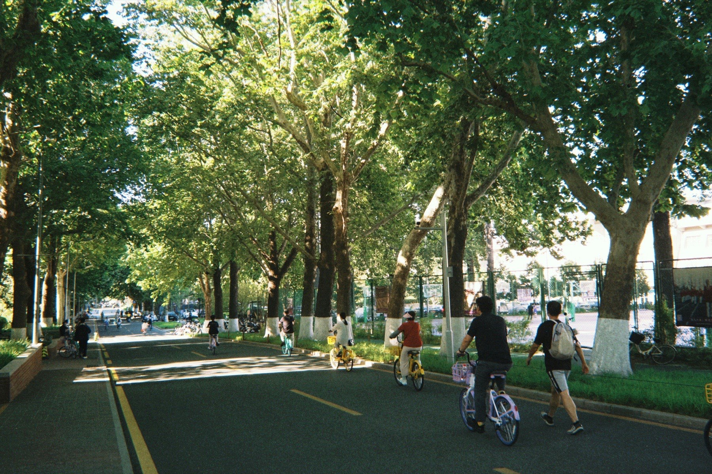
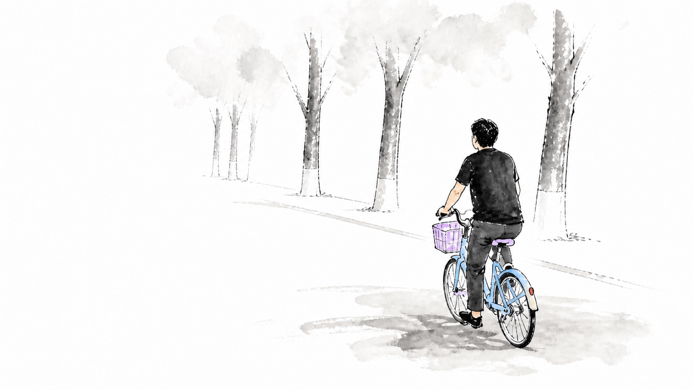
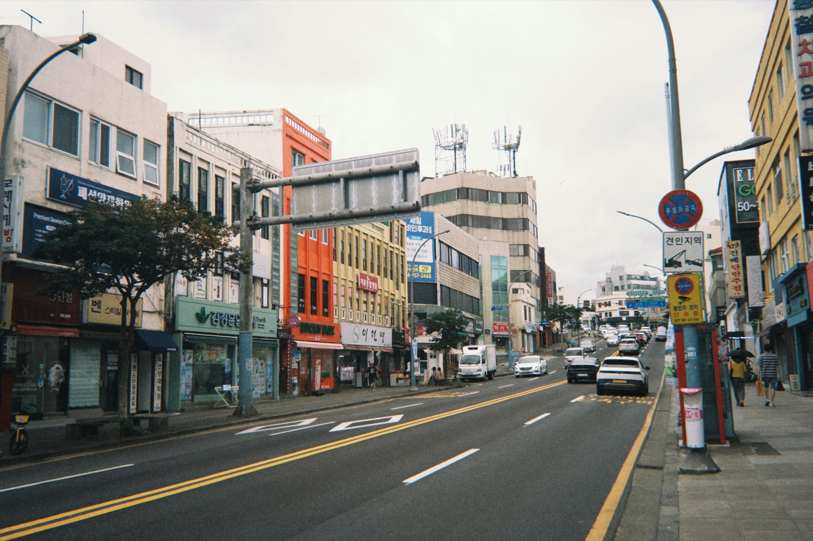
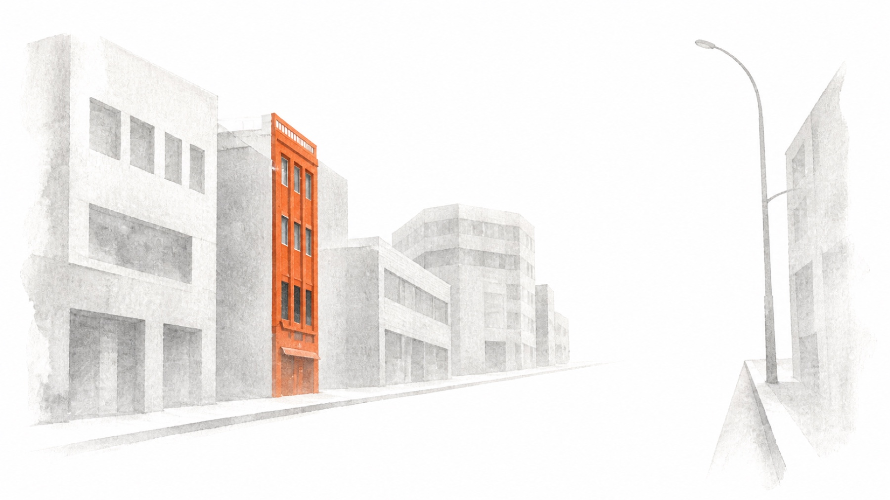

# Decisive Frame

Turn a supplied photograph into a 16:9 cinematic ink still where exactly one approved local element or color region retains source-derived color and the remaining scene is reconstructed as sparse ink on a clean white field.

> A monochrome world. One decisive presence still has color.

## Before → After

| Before | After |
|---|---|
|  |  |
|  |  |

Explore all seven approved transformations in the [public showcase](examples/README.md).

## What makes it different

Decisive Frame is not a global selective-color filter and not a torn-paper zine template. It first reads the photograph, chooses either **Decisive Element Mode** or **Decisive Color Mode**, offers two or three director candidates, and waits for the user to select one before generating anything.

The chosen anchor keeps its source hue with restrained purification and deepening. A human anchor becomes one coherent source-aware gesture-line and translucent color-wash figure: pose, proportions, clothing silhouette, and hair mass survive, while facial detail is deliberately reduced according to scale instead of being regenerated photorealistically. Non-human anchors remain material-faithful. Everything else is rebuilt through a keep / merge / omit / expose hierarchy: defining structure survives, secondary scenery collapses into pale broad washes, low-value detail disappears, and a contiguous white field becomes an active compositional mass. When the anchor needs separation, one adaptive light-to-mid neutral support is shaped from nearby scene geometry or a soft ink cradle. It must remain quieter than the anchor and must not read as a desaturated photograph.

## Workflow

```text
photo
→ choose one mode
→ offer 2–3 same-mode candidates
→ user selects and may supply an exact edge time
→ generate a 16:9 preview
→ inspect and analyze color leakage
→ correct at most once
→ save only after approval
```

## Modes

- **Decisive Element:** Use a small, separable, narratively important person or object. The final colored element must remain below half the frame.
- **Decisive Color:** Use only when no valid element exists. Retain one meaningful local occurrence of a source hue; all other matching hues become monochrome.

## Install

Install directly from GitHub with Codex's bundled skill installer:

```bash
python3 ~/.codex/skills/.system/skill-installer/scripts/install-skill-from-github.py \
  --repo an-an-618/decisive-frame-skill \
  --path skills/decisive-frame-v1
```

Or copy the installable skill from a local checkout:

```bash
mkdir -p ~/.codex/skills
cp -R skills/decisive-frame-v1 ~/.codex/skills/
```

Restart Codex if the skill does not appear immediately.

The optional deterministic analyzer uses Pillow. Image generation can continue with visual QA when Pillow is unavailable; do not install dependencies silently during a user task.

## Use

Upload a photo, then invoke:

```text
Use $decisive-frame-v1 to process this photo.
```

The skill returns candidates first. Select one with `A`, `B`, or `C`. To add an edge time, provide it with the selection:

```text
B — 17:42
```

Selecting only `B` proceeds immediately with no text in the image.

## Repository

```text
skills/decisive-frame-v1/   installable skill
tests/                      deterministic analyzer tests
evals/                      behavior scenarios and local-test registry
examples/                   individually approved public cases only
docs/                       design and implementation plans
```

## Privacy and example media

Source photos are used only for the requested task. Do not browse, share, upload, commit, or copy them into a project unless the user explicitly authorizes that action.

Permission to test a photo locally is not permission to publish it. Every public example requires separate approval for its source and result. Example-media permissions are separate from the repository license.

## License

Skill code and documentation are licensed under [PolyForm Noncommercial License 1.0.0](https://polyformproject.org/licenses/noncommercial/1.0.0). Commercial use requires separate permission from the licensor.
