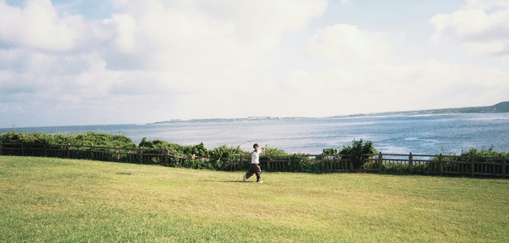
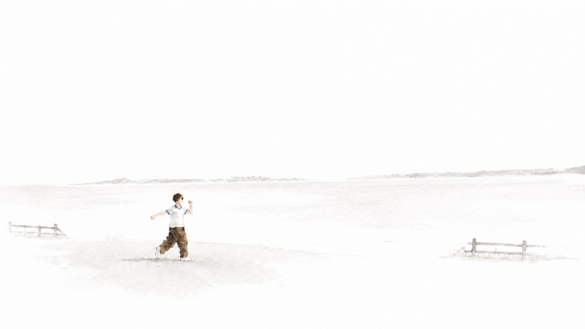
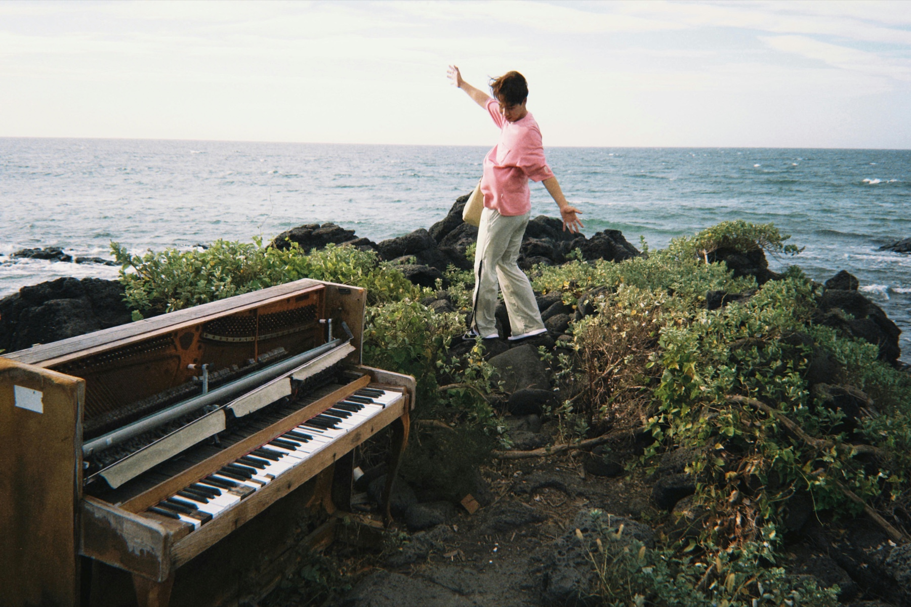
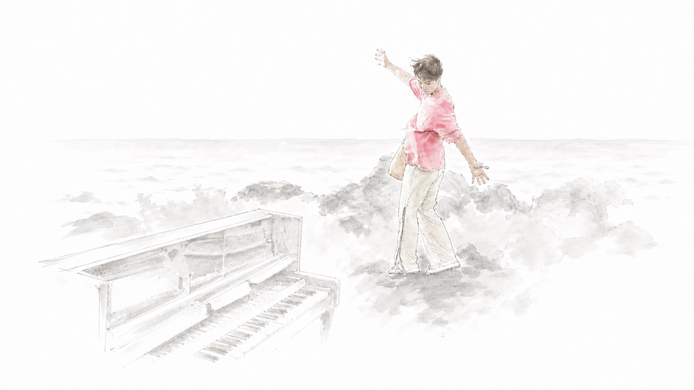
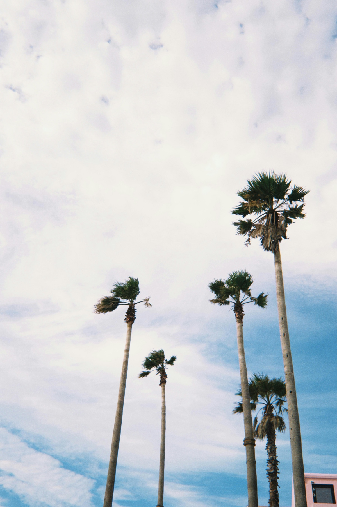
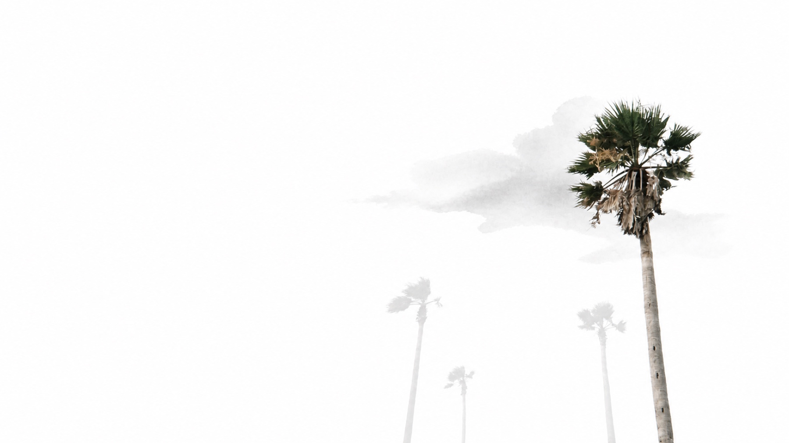
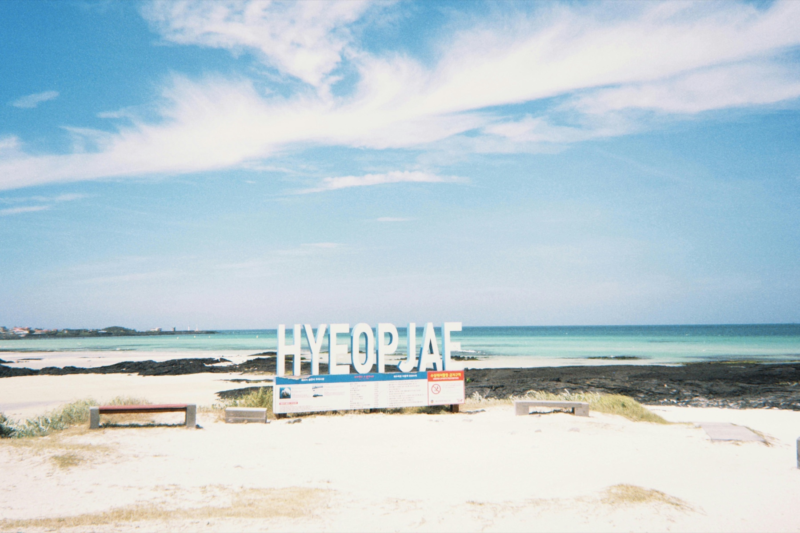
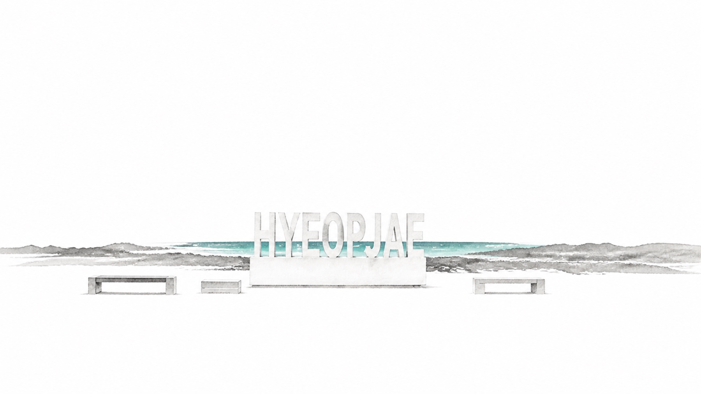
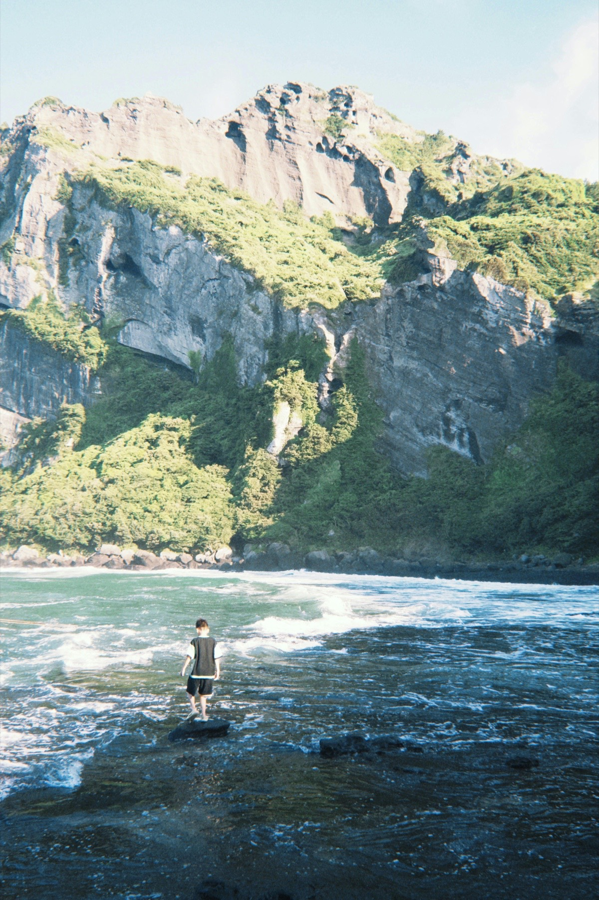
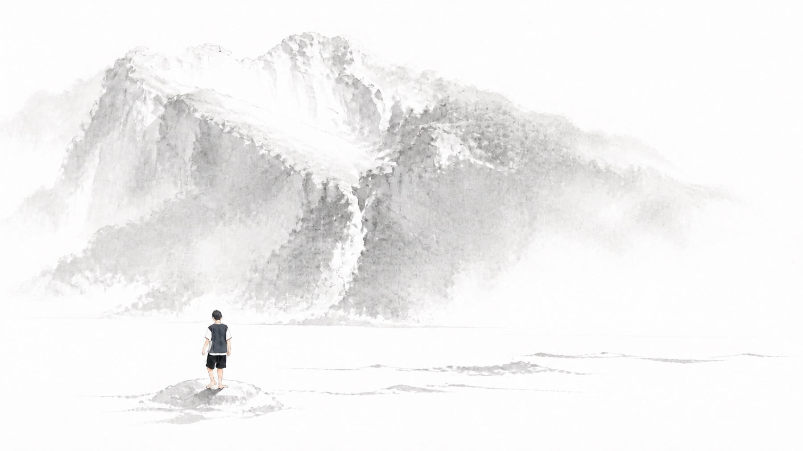

# Decisive Frame Showcase

Seven public **Before → After** pairs approved by the photo owner on 2026-08-25. These examples show the two selection modes, white-ground ink reconstruction, human line-and-wash abstraction, and single-anchor color discipline. Full generation prompts and unrelated test photographs are intentionally excluded.

## 01 · Tree Lane Cyclist / 林荫骑行

**Decisive Element:** the foreground cyclist becomes a coherent line-and-wash figure while the tree lane dissolves into pale rhythm and open white space.

| Before | After |
|---|---|
|  |  |

## 02 · Coastal Field Runner / 海岸草地奔跑者

**Decisive Element:** the distant runner carries the gesture; grass, sea, and fencing become nearly silent horizontal intervals.

| Before | After |
|---|---|
|  |  |

## 03 · Seaside Piano Gesture / 海边钢琴与手势

**Decisive Element:** the pink-shirted figure retains translucent source color; piano, rocks, and coast become restrained graphite and mineral wash.

| Before | After |
|---|---|
|  |  |

## 04 · Orange City Facade / 城市里的橙红立面

**Decisive Color:** one orange-red facade concentrates the uphill urban perspective while signs, cars, and neighboring buildings are compressed or omitted.

| Before | After |
|---|---|
|  |  |

## 05 · Tallest Palm / 最高的棕榈树

**Decisive Element:** only the tallest palm remains colored; the other trunks and cloud field recede into spare pale marks.

| Before | After |
|---|---|
|  |  |

## 06 · Hyeopjae Turquoise Line / 挟才海岸的绿松石色线

**Decisive Color:** a narrow turquoise water line survives behind the physical letters, turning the horizon into a quiet cinematic interval.

| Before | After |
|---|---|
|  |  |

## 07 · Cliffside Witness / 山崖前的观看者

**Decisive Element:** the small rear-view figure becomes an economical line-and-wash witness while cliff, surf, and foreground open into white-ground ink.

| Before | After |
|---|---|
|  |  |

## Publication scope

The owner authorized public display of these seven before-and-after pairs. This permission does not extend to unrelated source photographs, hidden prompts, temporary previews, or future user media. Example-media permission remains separate from the repository license.
